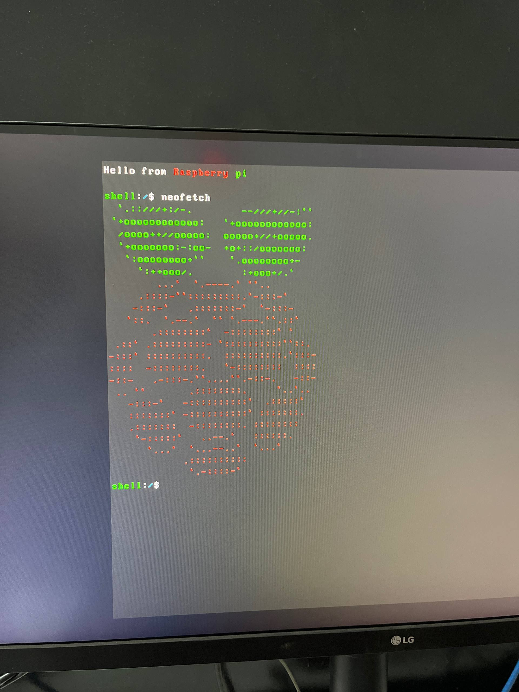
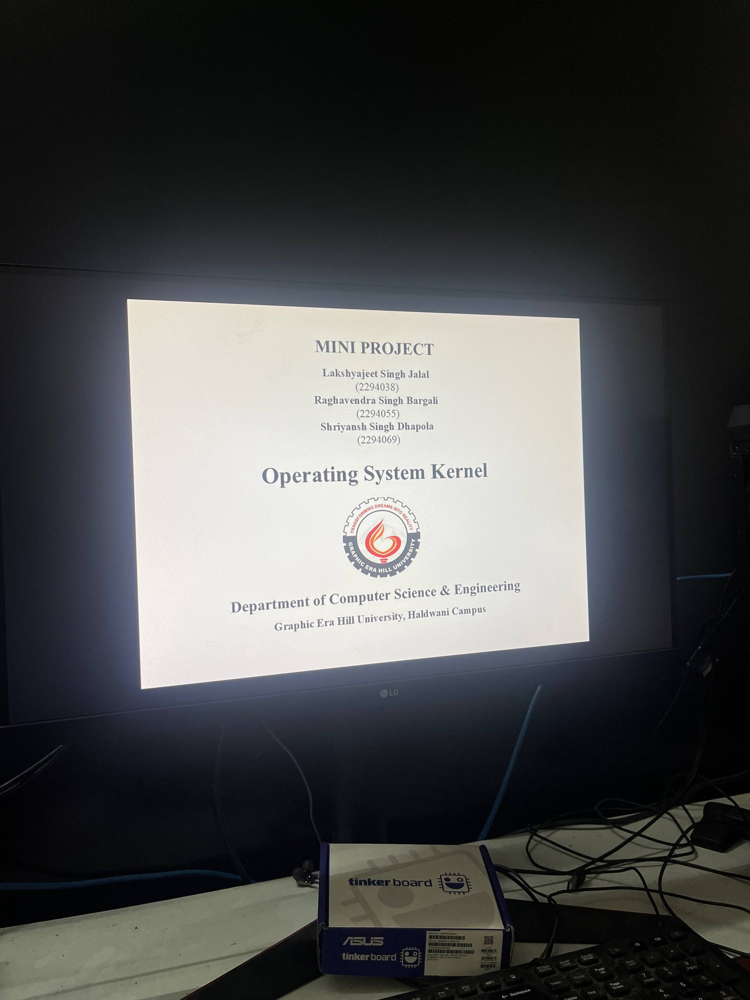

# OS Kernel for Raspberry Pi 3B+

Multitasking OS Kernel designed for Raspberry Pi 3B+.

Features:

    - Memory Paging
    - Multitasking
    - FAT16 File System
    - Framebuffer GUI and DMA controler
    - Terminl Shell

> 5th sem mini project

<video src="./assets/demo.webm" controls muted></video>
